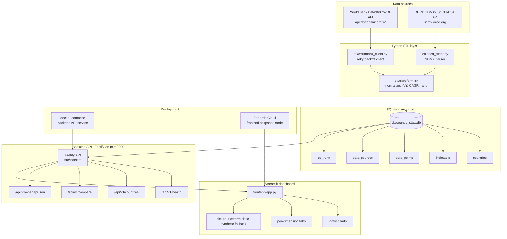

# Future OECD Country Trend

A full-stack macro-data dashboard for analysts and technical hiring managers to compare country trends across the United States, China, Japan, Australia, and Canada.

🚀 **Live Demo:** [Streamlit Cloud](https://TODO-fill-in.streamlit.app)

> TODO: add a production screenshot after the Streamlit Cloud deployment is live.
>
> 


## 🌐 View it online

Open the dashboard in one click:
[Streamlit Cloud](https://TODO-fill-in.streamlit.app).

The hosted frontend is designed to work in a static-snapshot mode, so the UI can
remain available even when the backend API is not deployed.

## 🧭 Architecture



## 🐳 Run locally with Docker

```bash
git clone https://github.com/Jeremygarden/future-OEDC-country-trend.git && cd future-OEDC-country-trend && docker compose up
```

Docker Compose brings up the Fastify backend API at
`http://localhost:3000/api/v1`. The current compose file ships the backend API
service; run the Streamlit frontend separately:

```bash
pip install -r frontend/requirements.txt && streamlit run frontend/app.py
```

Optional backend URL override:

```bash
BACKEND_API_URL=http://localhost:3000/api/v1 streamlit run frontend/app.py
```

## 🛠️ Development setup

```bash
python3 -m venv .venv
source .venv/bin/activate
pip install -r requirements.txt
python scripts/run_etl.py
```

Start the TypeScript/Fastify backend:

```bash
npm install && npm start
```

For local development with file watching, use `npm run dev` after installing
Node dependencies. The unified CI entrypoint is:

```bash
bash scripts/ci.sh
```

## ✨ Features

- Multi-country side-by-side comparison for USA, China, Japan, Australia, and Canada.
- 9 macro indicators: GDP, CPI, unemployment, debt, energy, tax, FDI, savings, and health.
- YoY KPI cards with latest value, year-over-year delta, and country rank.
- Per-dimension drill-down tabs for Debt, Energy, Taxation, FDI, Household Savings, and Health Spending.
- Deterministic synthetic fallback when the backend or external APIs are unreachable.
- OpenAPI spec published at `/api/v1/openapi.json`.

## 📁 Project structure

```text
etl/              Python clients for World Bank and OECD data ingestion.
db/               SQLite schema, query helpers, views, and TTL file cache.
models/           SQLAlchemy ORM models for warehouse tables and ETL audit logs.
src/              Node.js/TypeScript Fastify backend routes, plugins, and services.
frontend/         Streamlit dashboard with Plotly charts and fallback data client.
fixtures/         Sample country and time-series payloads for offline development.
scripts/          ETL orchestration, seeding, snapshot build, and CI scripts.
tests/            Python ETL/database tests plus backend test helpers.
data/snapshots/   Offline snapshot exports for static frontend deployment.
```

## 📊 Data sources & methodology

Primary indicators are refreshed from the World Bank WDI API, a free no-auth
source available at `https://api.worldbank.org/v2`; the client also documents
World Bank Data360 as the broader source context. OECD-specific series are
fetched from the OECD SDMX-JSON REST API at `https://sdmx.oecd.org`. The
`scripts/run_etl.py` orchestrator runs World Bank and OECD pipelines, writes
normalized records into the SQLite warehouse, and records audit metadata in
`etl_runs`. Snapshot exports in `data/snapshots/` support static frontend-only
Streamlit deployments.

## 🧪 API surface

The backend runs on Fastify with TypeScript and exposes versioned JSON routes:

- `GET /api/v1/health` — service health check.
- `GET /api/v1/countries` — searchable, sortable country list.
- `GET /api/v1/compare` — compare one indicator across multiple countries.
- `GET /api/v1/openapi.json` — OpenAPI 3.0 contract.

Additional implemented routes include `/countries/summary`, `/timeseries`,
`/indicators`, `/forecast`, `/metrics`, and `/docs`.

## 🏗️ Engineering highlights

- **Full-stack delivery:** Python data layer, Node.js/TypeScript API, and Streamlit visualization UI.
- **Production patterns:** structured ETL with retry/backoff, SQLAlchemy ORM with Alembic configuration, TTL file cache, and structured error envelopes.
- **Quality:** pytest test suite in `tests/` and `frontend/tests/`, ESLint + Prettier, `scripts/ci.sh`, and a GitHub Actions workflow template in `docs/ci-workflow.yml.example`.
- **Containerized path:** Docker Compose runs the backend service, and the Dockerfile packages the Fastify API for local or hosted deployment.
- **Observability:** `etl_runs` audit table, `/health` endpoint, `/metrics` counters, and an OpenAPI spec published by the API.
- **Graceful degradation:** deterministic synthetic series keep charts and KPI cards usable when the backend or external APIs are down.

## 🤝 Contributing & security

Contributions are welcome. Please read [CONTRIBUTING.md](CONTRIBUTING.md) for
local workflow guidance and [SECURITY.md](SECURITY.md) for responsible security
reporting.

## 📄 License

No standalone license file is currently included. The backend package metadata
uses the ISC license; confirm project-level licensing before redistributing.
